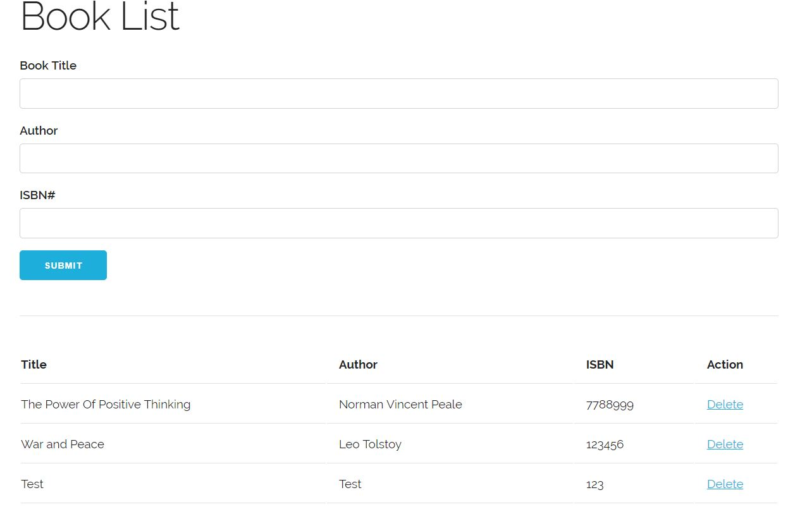

# Book List App
## Takes book details and shows them in the table below. Stores inputs in local storage.

### OOP written in ES5 and ES6

## Techniques and technologies:

### Skeleton.css, OOP, ES5, ES6, LocalStorage

